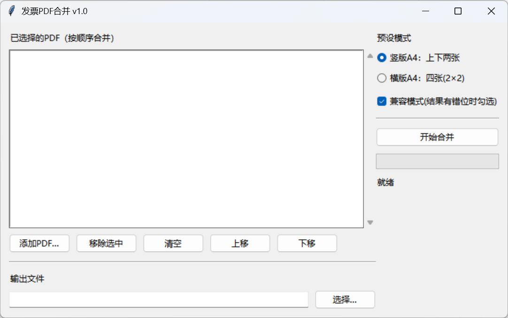

# InvoiceMerger.exe（发票PDF合并） 使用说明

本说明适用于已打包好的 Windows 可执行程序，用于将多个发票 PDF 合并并排版输出为 A4。

## 两种 EXE

本项目通常会生成两种版本，任选其一使用即可。[或者直接下载release目录中的单exe版](https://github.com/caviardumpling/A4Pdf_InvoiceMerger/releases/latest)

### 1) 目录版

- 路径：`dist/InvoiceMerger/InvoiceMerger.exe`
- 使用方式：需要保留整个 `dist/InvoiceMerger/` 文件夹（包含 `_internal` 等依赖）。
- 优点：更稳定，出问题概率更低。

### 2) 单exe版

- 路径：`release/InvoiceMerger.exe`
- 使用方式：只需要这一个 exe 文件即可运行。
- 说明：体积会更大（把依赖都打进 exe 里）。

## 基本使用流程

1. 双击运行 `InvoiceMerger.exe`
2. 点击“添加PDF…”选择要合并的发票 PDF（可多选）
3. （可选）用“上移/下移”调整合并顺序
4. 选择“预设模式”
   - 竖版A4：上下两张
   - 横版A4：四张(2×2)
5. 点击“选择…”设置输出 PDF 的保存位置
6. 点击“开始合并”，等待进度条完成

合并完成后会弹窗提示输出文件路径。

## 兼容模式（重要）

界面右侧有“兼容模式(结果有错位时勾选)”选项：

- 建议保持勾选（默认勾选）：
  - 解决部分电子发票中“税务章/下载次数”等元素作为注释层导致矢量合并时不随页面移动的问题。
  - 原理：先把原 PDF 页面渲染成图片再排版，因此所有可见元素都会到最终输出中。
  - 代价：输出文件体积会更大。

- 取消勾选：
  - 使用矢量方式合并，输出更清晰、文件更小。
  - 但少数发票可能出现“税务章/下载次数”不跟随的情况。

